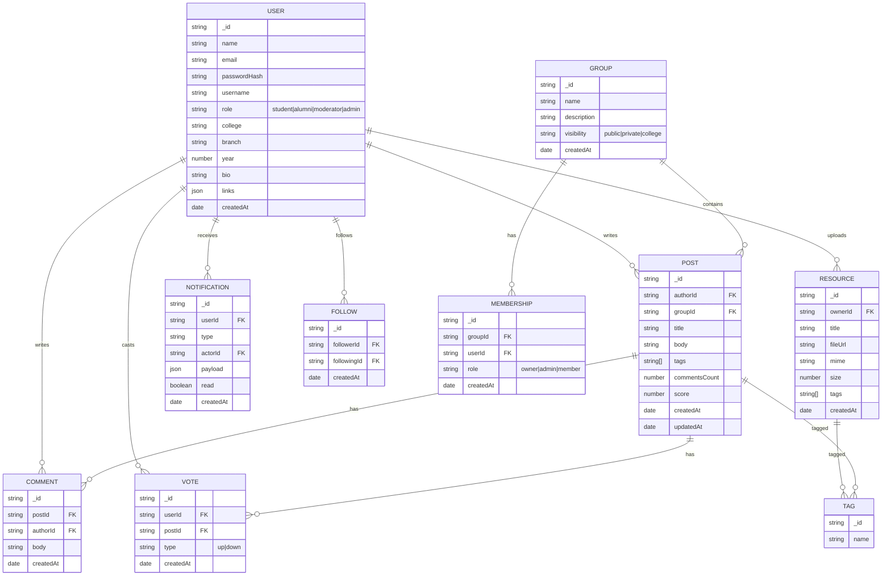

# 🗄️ DATABASE.md — Studium

This document captures the **data model**, **ERD**, and **relationships** for Studium.

---

## 1) Entity-Relationship Diagram (ERD)



> Note: In MongoDB, many joins are represented by **referencing IDs**; some relationships (e.g., tags) can also be embedded depending on query patterns.

---

## 2) Collection Design (MongoDB)

### `users`
- Indexes: `email (unique)`, `username (unique)`, `college`, `createdAt`
- Example:
```json
{
  "_id": "u123",
  "name": "Rajat",
  "email": "rajat@college.edu",
  "passwordHash": "bcrypt...",
  "username": "rajat",
  "role": "student",
  "college": "ABC Institute",
  "branch": "CSE",
  "year": 2,
  "bio": "Full-stack dev",
  "links": { "github": "https://github.com/..." },
  "createdAt": "2025-08-01T10:00:00Z"
}
```

### `posts`
- Indexes: `authorId`, `groupId`, `tags`, `createdAt (desc)`, compound: `{groupId, createdAt}` for feeds
```json
{
  "_id": "p1",
  "authorId": "u123",
  "groupId": "g1",
  "title": "How to crack DSA round?",
  "body": "Tips & resources...",
  "tags": ["#placement", "#dsa"],
  "commentsCount": 3,
  "score": 12,
  "createdAt": "2025-08-02T12:00:00Z",
  "updatedAt": "2025-08-02T12:05:00Z"
}
```

### `comments`
- Indexes: `postId`, `authorId`, `createdAt`
```json
{
  "_id": "c1",
  "postId": "p1",
  "authorId": "u456",
  "body": "Start with LC patterns.",
  "createdAt": "2025-08-02T12:10:00Z"
}
```

### `resources`
- Indexes: `ownerId`, `tags`, `createdAt`
```json
{
  "_id": "r1",
  "ownerId": "u123",
  "title": "OS Notes",
  "fileUrl": "https://s3.../os.pdf",
  "mime": "application/pdf",
  "size": 524288,
  "tags": ["os", "semester-3"],
  "createdAt": "2025-08-02T13:00:00Z"
}
```

### `groups`
- Indexes: `name (text)`, `visibility`, `createdAt`
```json
{
  "_id": "g1",
  "name": "CSE '27",
  "description": "Batch group",
  "visibility": "college",
  "createdAt": "2025-08-01T08:00:00Z"
}
```

### `memberships`
- Indexes: `groupId`, `userId`, unique compound `{groupId, userId}`
```json
{
  "_id": "m1",
  "groupId": "g1",
  "userId": "u123",
  "role": "admin",
  "createdAt": "2025-08-01T08:10:00Z"
}
```

### `notifications`
- Indexes: `userId`, `read`, `createdAt (desc)`

### `follows`
- Unique compound index `{ followerId: 1, followingId: 1 }`

### `votes`
- Unique compound index `{ userId: 1, postId: 1 }`

---

## 3) Data Integrity & Patterns

- Use **referential IDs** to connect documents.
- Apply **unique constraints** for follows and votes to avoid duplicates.
- **Precompute counters** (e.g., `commentsCount`, `score`) for feed performance.
- Use **TTL indexes** for ephemeral data (e.g., session tokens if stored).

---

## 4) Migrations & Seeding

- Write scripts in `src/scripts/` for **seed** and **migrate**.
- Use idempotent migrations (check existence before create/modify).
