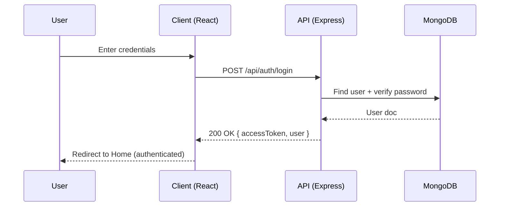
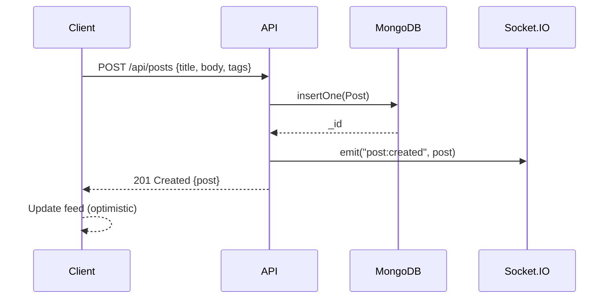
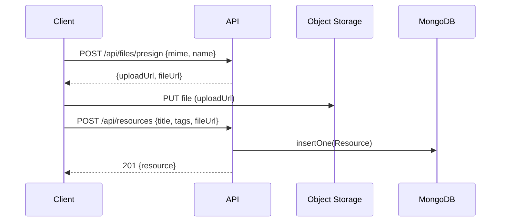
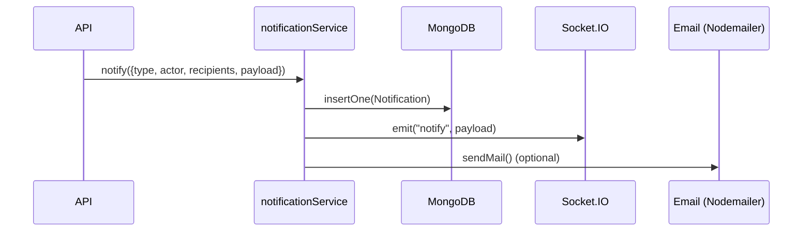

# 🧭 WORKFLOW.md — Studium (Notion + Reddit + LinkedIn for your college)

> **Studium** is a campus-first platform where students can **share knowledge (Notion-like)**, **discuss & ask questions (Reddit-like)**, and **network with peers/seniors/alumni (LinkedIn-like)**.  
> This document explains **how the system works end‑to‑end**: actors, request lifecycle, core user journeys, data flow, and operational concerns.

---

## 0) System Overview

**Actors**
- **Guest**: Can browse public content (if allowed), must sign up to interact.
- **Student**: Core user; creates posts, comments, uploads resources, follows others.
- **Senior/Alumni**: All student capabilities + higher trust; provides mentorship.
- **Moderator**: Handles reports, edits/removes abusive content.
- **Admin**: Manages global settings, feature flags, and moderation policies.

**Major Subsystems**
- **Client App (React + Router + Tailwind)** — SPA that calls the API and renders UI.
- **API Server (Node.js + Express)** — Auth, business logic, validation, routing.
- **Database (MongoDB)** — Users, posts, comments, notes/resources, groups, notifications.
- **Object Storage (e.g., S3/Cloudinary)** — PDFs, images, and other large files.
- **Realtime (Socket.IO)** — Notifications and chat.
- **Email/Push (Nodemailer/Web Push)** — Account + activity notifications.
- **Search (DB queries; optional index like Meilisearch/Atlas Search)** — Keyword + filtered discovery.

---

## 1) Architecture Diagram

The following diagram illustrates the high-level data flow between the SPA, API, DB, storage, and realtime channels.


> Place the SVG at `docs/system-architecture.svg` in your repository (this file is included alongside this document).

---

## 2) Request Lifecycle (End‑to‑End)

1. **UI event** — User performs an action (e.g., “Create Post”).
2. **Client validations** — Basic field checks; user must be authenticated for protected actions.
3. **API call** — SPA issues `fetch`/`axios` request with **JWT** in `Authorization: Bearer <token>`.
4. **Routing & middleware** — Express receives request → logging → rate limiting → `authMiddleware` → input validation.
5. **Controller logic** — Calls services and models; enforces **RBAC** (role-based permissions).
6. **DB/storage actions** — Read/write in MongoDB; upload files to S3/Cloudinary (store only URLs in DB).
7. **Side effects** — Emit Socket.IO events, enqueue emails/notifications.
8. **Response** — JSON payload with result or error (standardized shape).
9. **Client state update** — UI updates; may use optimistic updates for snappy UX.
10. **Background processing** — Async tasks (thumbnails, email delivery, cleanup) complete after response.

### Standard API Response Shape
```json
{
  "success": true,
  "data": { /* resource payload */ },
  "error": null,
  "meta": { "requestId": "uuid", "t": 1734829384 }
}
```
On error:
```json
{
  "success": false,
  "data": null,
  "error": { "code": "VALIDATION_ERROR", "message": "Title is required" }
}
```

---

## 3) Core User Journeys (Detailed)

### A) Sign Up / Login
**Goal:** Create an account and obtain a JWT for authenticated actions.

**Flow:**
1. User submits **email/roll no + password** (later: OAuth/Google).
2. Client → `POST /api/auth/register` → validate → create `User` in DB (hashed password).
3. On login (`POST /api/auth/login`), server verifies credentials → issues **JWT** (and optional refresh token).
4. Client stores token (in memory or `httpOnly` cookie) and sets auth state.

**Mermaid Sequence**


---

### B) Create a Post (Reddit-like)
**Goal:** Share a question/discussion with tags; enable comments & votes.

**Flow:**
1. Client enforces auth → collects `title`, `body`, `tags`.
2. `POST /api/posts` with JWT → controller validates & sanitizes content.
3. Save `Post` in MongoDB (author = userId).
4. Emit `post:created` via Socket.IO to followers/topics.
5. Return post; client prepends to feed with optimistic UI.

**Key Collections:** `posts`, `users`, `notifications`.

**Mermaid Sequence**


---

### C) Comment & Upvote
**Goal:** Interact with posts to surface useful content.

**Flow:**
- **Comment:** `POST /api/posts/:id/comments` → create `Comment` linked to `Post`.
- **Upvote:** `POST /api/posts/:id/vote` with `{ type: "up" | "down" }` → maintain `votes` set per user.

**Rules:**
- Single vote per user per post; toggling switches state.
- Notify post author on first comment/upvote (rate-limit notifications).

---

### D) Upload Notes/Files (Notion-like resources)
**Goal:** Share PDFs/notes with tags and metadata.

**Flow:**
1. Client gets pre-signed URL (`POST /api/files/presign` or uses `uploadMiddleware` if multipart).
2. Upload file directly to S3/Cloudinary.
3. `POST /api/resources` with `{ title, tags, fileUrl, size, mime }`.
4. Index for search (tag/keyword); show preview if supported.

**Mermaid Sequence (Presigned Upload)**


---

### E) Profiles & Connections (LinkedIn-like)
**Goal:** Build a campus graph (follow/connect).

**Flow:**
- **View profile:** `GET /api/users/:username` → public fields + stats.
- **Follow:** `POST /api/users/:id/follow` → maintain follower/following sets.
- **Feed composition:** posts from followed users + trending in your college/department.

**Permissions:** Users can set profile fields to `public | college-only | followers`.

---

### F) Mentorship & Q&A
**Goal:** Route juniors to seniors/alumni by topics (DSA, ML, Placements).

**Flow:**
1. Ask a question with topic tags.
2. System recommends mentors (skill match) and notifies them.
3. Accepted answers can be marked **“Solved”**; solution is pinned and searchable.

---

### G) Notifications (Realtime + Email)
**Triggers:** new comment, upvote, follow, mention, accepted answer, file shared in your group.

**Pipeline:**
- Controller pushes an **event** → `notificationService` creates `Notification` doc.
- Emit Socket.IO event to online recipients.
- Enqueue email for offline users (optional job queue).

**Mermaid Sequence**


---

### H) Search & Discovery
**Goal:** Find users, posts, notes quickly.

**Implementation Options:**
- **Phase 1:** MongoDB text indexes + filters (tags, semester, branch).
- **Phase 2:** Dedicated search (Meilisearch/Atlas Search) for relevance, typo-tolerance.

**Endpoints:**
- `GET /api/search?q=&type=post|user|resource&tags=`

---

### I) Moderation & Reporting
**Goal:** Keep community healthy.

**Flow:**
- Users **report** content → `POST /api/moderation/report`.
- Moderators review in dashboard, take actions: hide, warn, ban.
- Maintain **audit log** of moderator actions.

**Policies:**
- Rate-limit posting/commenting to prevent spam.
- Automatic filters for profanity/unsafe links (phase 2).

---

## 4) Data Model (Essentials)

- **User**: `{ _id, name, email, hash, role, college, branch, year, skills[], bio, links{}, followers[], following[], createdAt }`
- **Post**: `{ _id, author, title, body, tags[], votes{up[], down[]}, commentsCount, solvedCommentId?, createdAt }`
- **Comment**: `{ _id, postId, author, body, createdAt }`
- **Resource**: `{ _id, owner, title, tags[], fileUrl, size, mime, downloadsCount, createdAt }`
- **Group**: `{ _id, name, description, members[], visibility, createdAt }`
- **Notification**: `{ _id, userId, type, actor, read, payload{}, createdAt }`

> Store **only file URLs** in DB; binary files live in object storage.

---

## 5) Security & Permissions

- **Auth:** JWT access token (short TTL) + optional refresh token.
- **RBAC:** Roles: `student`, `alumni`, `moderator`, `admin`.
- **Input Validation:** JOI/Zod on critical endpoints.
- **Sanitization:** Escape HTML/markdown; block XSS content.
- **Rate Limiting:** Per-IP & per-user limits on write endpoints.
- **CORS:** Restrict to known front-end origins.
- **Secrets:** `.env` for secrets; never log sensitive data.

---

## 6) Performance & Reliability

- **Optimistic UI** for posts/comments.
- **Pagination & cursor-based feeds** (e.g., `?cursor=<createdAt>`).
- **Indexes** on hot fields: `posts.tags`, `posts.createdAt`, `users.username`, `resources.tags`.
- **CDN** for static assets/files (S3 + CloudFront or equivalent).
- **Background Jobs** for emails, thumbnails, heavy processing.
- **Observability**: request logging (Winston), metrics (Prometheus) and tracing (optional).

---

## 7) Deployment Flow

- **Environments:** `dev` → `staging` → `prod`.
- **CI/CD:** GitHub Actions for lint/test/build → deploy (Vercel/Render/Fly.io).
- **Runtime:** Node.js server (PM2/Docker). MongoDB Atlas for DB. S3/Cloudinary for storage.
- **Env Vars:** `MONGO_URI`, `JWT_SECRET`, `S3_BUCKET`, `S3_KEY`, `S3_SECRET`, `CORS_ORIGIN`, `EMAIL_SMTP_*`.

---

## 8) Failure Modes & Recovery

- **DB down** → retry with exponential backoff; show friendly error to user.
- **Storage fail** → keep upload resumable; validate file checksums.
- **Email queue fail** → persist unsent notifications; retry with dead-letter queue.
- **Hot path errors** → centralized `errorHandler` returns stable error shape.
- **Abuse/spam** → throttle + captcha on suspicious activity.

---

## 9) Glossary

- **Resource**: Any uploaded file/Note shared by users.
- **Feed**: Timeline composed from followed users + trending campus topics.
- **Solved**: Q&A thread with an accepted/best answer.
- **RBAC**: Role-Based Access Control for permissions.

---

## 10) Quick Endpoint Map (sample)

```
POST   /api/auth/register
POST   /api/auth/login
GET    /api/users/:id
POST   /api/users/:id/follow
GET    /api/posts?cursor=&tag=
POST   /api/posts
POST   /api/posts/:id/comments
POST   /api/posts/:id/vote
POST   /api/files/presign
POST   /api/resources
GET    /api/search?q=
POST   /api/moderation/report
```

---

### ✅ TL;DR
- **Client** fires action → **API** validates & executes → **DB/Storage** persists → **Realtime/Email** notify → **Client** updates UI.  
- Build in phases: **MVP (Posts + Files + Profiles)** → **Collaboration & Mentorship** → **Search & AI** → **Multi-campus scale**.

