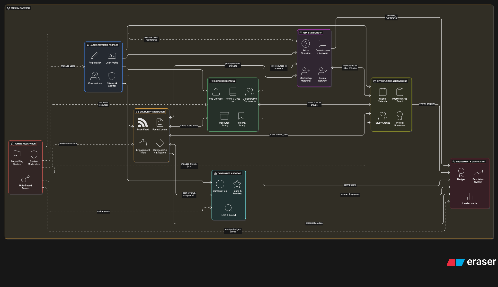

# 🗺️ Studium Roadmap

> **Tagline:** _“Notion + Reddit + LinkedIn, but for your college.”_  
> A platform where students can **connect, collaborate, share resources, and build their campus network.**

---

## 🎯 Vision

Studium helps students bridge the gap between **academics, community, and career** by giving them a single platform to:

- Interact with peers and seniors
- Share files, notes, and projects
- Ask and answer questions (Reddit-style)
- Build profiles for skills and networking (LinkedIn-style)
- Organize personal notes, tasks, and docs (Notion-style)

---

## 📊 Current Architecture

  
_(The above diagram explains the high-level system flow — see `/docs` folder for the source SVG.)_

---

## 🚀 Roadmap

### ✅ Phase 1 – MVP (3 months)

- [ ] **User Accounts** – signup/login (JWT auth, no student ID validation initially)
- [ ] **Profiles** – name, course, skills, interests
- [ ] **Community Feed** – students can post, comment, react (Reddit-like)
- [ ] **Q&A Boards** – ask questions, upvote/downvote answers
- [ ] **File Sharing** – upload notes, PDFs, slides (with tags)
- [ ] **Search** – by user, post, file, or topic
- [ ] Basic mobile-responsive UI

---

### 🛠️ Phase 2 – Collaboration (3-6 months)

- [ ] **Clubs & Groups** – create groups (study groups, clubs, societies)
- [ ] **Events Module** – college events, workshops, hackathons
- [ ] **Resource Hub** – tagged collections (books, tutorials, notes)
- [ ] **Private Messaging** – chat with peers/seniors
- [ ] **Moderation Tools** – report, block, and basic admin dashboard

---

### 🌐 Phase 3 – Professional Growth (6-9 months)

- [ ] **LinkedIn-like Profiles** – projects, certifications, achievements
- [ ] **Skill Endorsements** – peers can endorse skills
- [ ] **Job/Internship Board** – students share or discover opportunities
- [ ] **Mentorship Connect** – find seniors/alumni for guidance

---

### 📒 Phase 4 – Personal Productivity (9-12 months)

- [ ] **Notion-style Notes** – rich text editor for docs/notes
- [ ] **Task Manager** – assignments, exams, deadlines
- [ ] **Knowledge Wiki** – shared editable pages for college resources

---

### 🔮 Phase 5 – Scaling & AI (12-18 months)

- [ ] **Recommendation Engine** – suggest peers, groups, and resources
- [ ] **AI Study Assistant** – summarize uploaded notes, generate quizzes
- [ ] **Mobile App** – React Native / Flutter app
- [ ] **Multi-College Support** – scale beyond one institution

---

## 📌 Tech Stack (Planned)

- **Frontend:** React (Vite) + TailwindCSS
- **Backend:** Node.js (Express / NestJS) + MongoDB
- **Auth:** JWT, optional OAuth for alumni
- **File Storage:** AWS S3 / Firebase Storage
- **CI/CD:** GitHub Actions + Vercel/Render

---

## 🏆 Long-term Goal

To make Studium the **go-to platform for every student** — from asking questions in their first year to showcasing their portfolio when they graduate.

---
